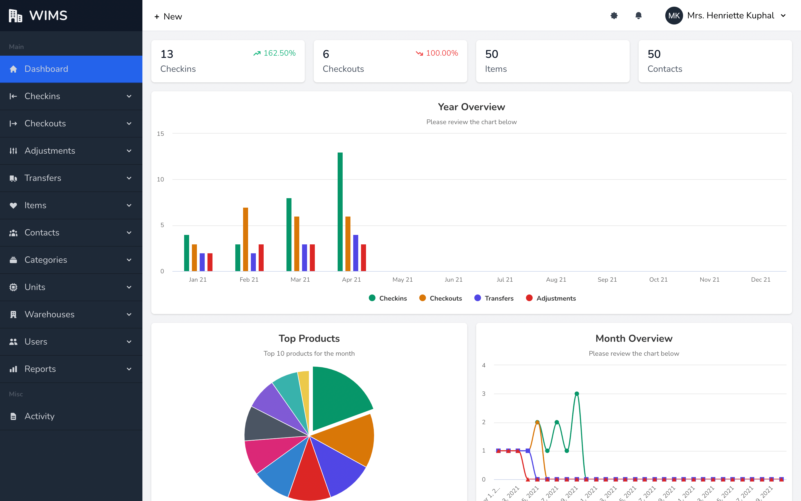
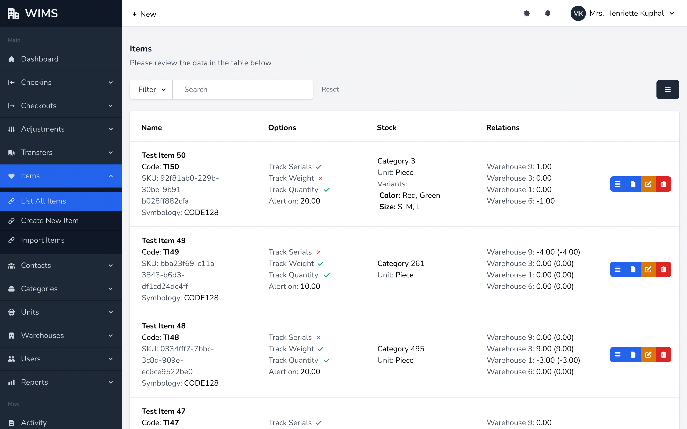

### General Guide

Warehouse Inventory Management System is designed & developed to suit the warehouse/godown/store management needs. We have tried to keep design and layout simple so that that everyone can easily get going. The design is responsive as we have added the progressive web app feature to it. WIMS look quite fine on all screen sizes.

All the tables are filter-able/& search-able with responsive styles, on the small screens, you can scroll to left to see data.

## Dashboard

Dashboard has number of Checkin, Checkouts, Items & Contacts. Check in/out are for this month with comparison increase/decrease of previous month.

Dashboard has 3 charts for year & month overview of the checkins, checkouts, transfers and adjustment. Third chart is for top items and these are calculated based on movement. The charts are graphical representation of the day's and month's inventory records. Charts have legend at bottom to enable/disable any field checkins, checkouts, transfers or adjustments.

We would like to listen your feedback to improve and make dashboard more informative.

## Activity Logs

WIMS will automatically logs all the activity in your app for super admin to review or audit any case.

## Screenshots

